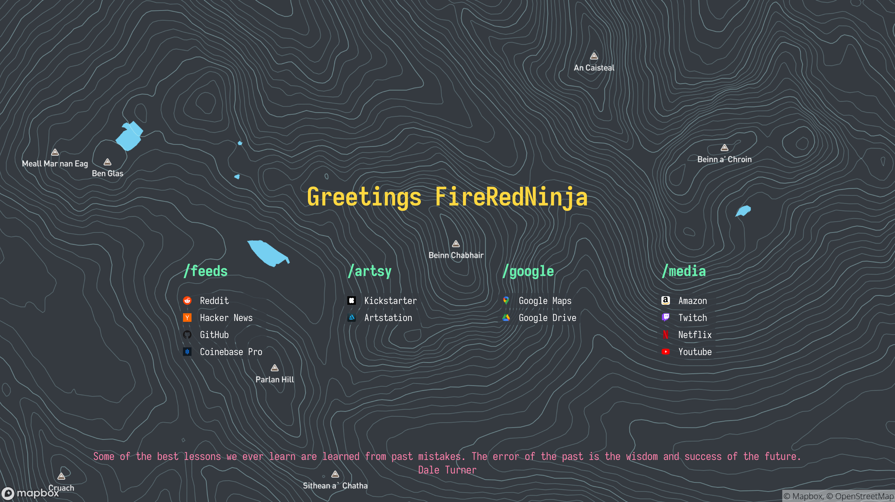

# Firefox New Tab Dashboard




## Requirements
- `node lts/fermium`
- `npm 6.14.9`
- This was build on MacOS

## Project setup
You'll need to get an API key from Mapbox and replace `"REPLACE ME"` from `mapboxToken.template.js` and rename it to `mapboxToken.js`.
```
npm install
```

### Compiles and hot-reloads for development
```
npm run serve
```

### Compiles and minifies for production
Creates a `dist` folder and `firefox.zip` which can be used to load the extension.
```
npm run build
```

### Lints and fixes files
```
npm run lint
```

### Customize configuration
See [Configuration Reference](https://cli.vuejs.org/config/).
